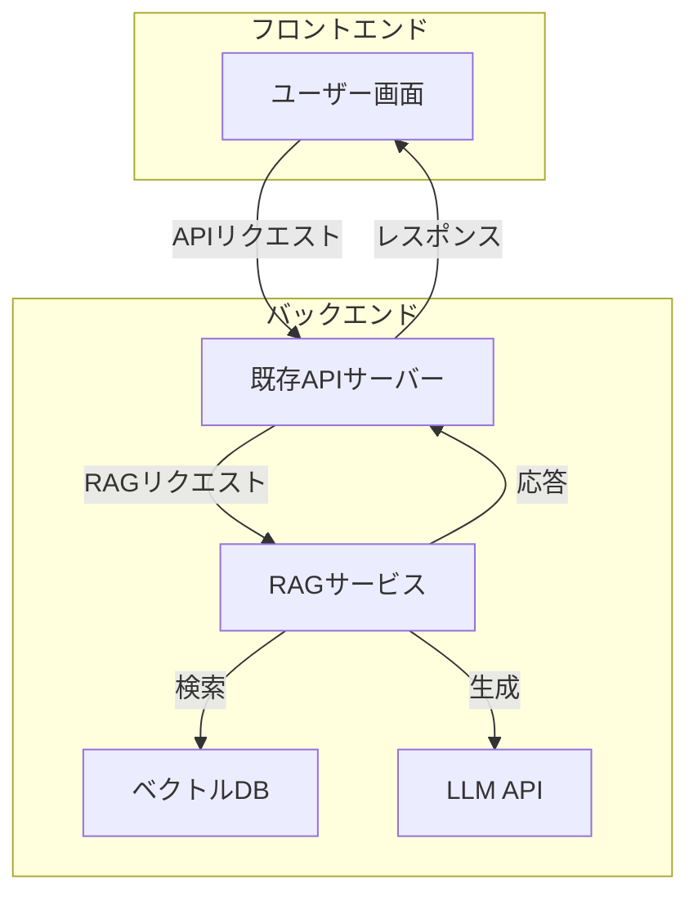
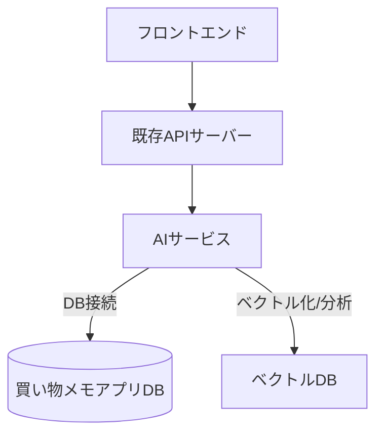

## 開発フロー

### 1. 環境構築

```bash
# 依存関係のインストール
go mod download

# 環境変数の設定
cp .env.example .env
# .envファイルを編集して必要な環境変数を設定
```

### 2. 開発手順

1. 機能開発

   - 新しい機能は feature ブランチで開発
   - ブランチ名: `feature/機能名`
   - 例: `feature/add-chat-function`

2. テスト

   - 単体テストの作成と実行

   ```bash
   go test ./...
   ```

   - カバレッジレポートの生成

   ```bash
   go test -coverprofile=coverage.out ./...
   go tool cover -html=coverage.out
   ```

3. コードレビュー

   - Pull Request の作成
   - レビュー依頼
   - レビューコメントへの対応

4. マージ
   - main ブランチへのマージ
   - デプロイ

### 3. デプロイフロー

1. ステージング環境へのデプロイ

   - 自動テストの実行
   - 動作確認

2. 本番環境へのデプロイ
   - バックアップの取得
   - デプロイ実行
   - 動作確認

### 4. モニタリング

- ログの確認
- パフォーマンスモニタリング
- エラー監視

### 5. メンテナンス

- 定期的な依存関係の更新
- セキュリティパッチの適用
- パフォーマンス最適化

# AI 機能の組み込みロードマップ

| フェーズ   | 期間      | 主な内容                           | 実装アプローチ                                                 | 主なインテリジェント応答機能                                                                 |
| :--------- | :-------- | :--------------------------------- | :------------------------------------------------------------- | :------------------------------------------------------------------------------------------- |
| フェーズ 1 | 1〜2 週間 | PoC・基礎検証                      | RAG 構成の PoC、ベクトル DB の選定・ローカル構築、LLM API 連携 | なし（基礎技術検証）                                                                         |
| フェーズ 2 | 2〜3 週間 | インテリジェント応答機能の実装     | Function Calling、自然言語 →SQL 分析、RAG 検索 API の実装      | 支出傾向分析、予算超過警告、カテゴリ別分析、予算管理提案、節約アドバイス、パーソナライズ推薦 |
| フェーズ 3 | 2〜3 週間 | 既存データのベクトル化・バッチ処理 | バッチ/ワーカーでのベクトル化、進捗管理 DB 設計                | ベクトル化データを活用した高度な RAG 応答、FAQ・ナレッジ検索                                 |
| フェーズ 4 | 2 週間    | マイクロサービス化・本番運用準備   | AI サービスの API 化、Render 等へのデプロイ、セキュリティ設計  | 全機能の統合・最適化、運用監視・改善                                                         |

- まずは RAG マイクロサービスを独立して設計・実装
- 既存 API サーバーから RAG サービスを呼び出す形で連携
- フロントエンドは従来通り API を利用

## RAG 機能のマイクロサービス化について

本プロジェクトでは、RAG（Retrieval-Augmented Generation）機能は既存 API サーバーに直接組み込まず、**マイクロサービスとして分離**して開発・運用する方針とします。

### マイクロサービス化のメリット

- 責務分離による保守性・拡張性の向上
- RAG 部分のみ独立してスケール可能
- 技術選定の自由度（例：Python+LangChain、Go+Qdrant 等）
- 他プロダクトや機能でも再利用しやすい
- セキュリティや運用の柔軟性

### 構成イメージ





## まとめ：AI サービス用リポジトリでやるべきこと

### 1. **Function Calling パターン**

- バックエンドで業務ロジックや集計関数を用意し、LLM から呼び出せるようにする
- 例：予算超過チェック、カテゴリ別集計など

### 2. **自然言語によるデータベース分析**

- ユーザーの自然言語クエリを SQL 等に変換し、DB からデータを取得・分析
- 例：「先月のビール代は？」→SQL 生成 →DB 検索 → 結果を LLM で自然言語化

### 3. **RAG 構成**

- ベクトル DB を用意し、非構造データや FAQ、ナレッジをベクトル化して格納
- ユーザーの質問をベクトル化し、類似情報を検索 →LLM のコンテキストに渡して応答生成

### 4. **既存データのベクトル化**

- 家計簿の履歴や説明文、アドバイス文などをバッチ処理や定期処理でベクトル化し、ベクトル DB に投入
- これにより RAG の検索精度が向上

## 典型的なリポジトリ構成例

```
ai-service/
  cmd/
    api/         # APIサーバー（Go/echo等）
      main.go
    batch/       # バッチ・ワーカー（ベクトル化や定期分析）
      main.go
  internal/
    function_calling/   # Function Calling関連ロジック
    db_analysis/        # 自然言語→SQL変換・分析
    rag/                # RAG関連ロジック
    vectorize/          # ベクトル化処理
  scripts/              # 開発・運用用スクリプト
  Dockerfile
  go.mod
  ...
```

## 補足

- **API サーバー**で Function Calling や自然言語分析、RAG のエンドポイントを提供
- **バッチ/ワーカー**で既存データのベクトル化や DB の定期分析を実施
- **internal 以下**で各機能をモジュール化し、保守性・拡張性を確保

## Function Calling と自然言語によるデータベース分析（NL2SQL）の違い

| 項目               | Function Calling                  | NL2SQL（自然言語 →SQL）      |
| ------------------ | --------------------------------- | ---------------------------- |
| LLM の役割         | 関数名と引数を決定                | SQL 文そのものを生成         |
| バックエンドの役割 | 関数を実装（SQL/ロジック/API 等） | 生成された SQL を実行        |
| 拡張性             | 関数を追加・修正して拡張          | どんな質問にも柔軟に対応可能 |
| セキュリティ       | 関数内で制御しやすい              | SQL インジェクション等に注意 |
| 使い分け           | 典型的な分析や業務処理            | 複雑・未知の問い合わせ       |

### 使い分けのポイント

- **Function Calling**：よく使う集計・分析・業務処理は「関数」として実装し、LLM に選ばせる（安全・堅牢・高速）
- **NL2SQL**：パターン化しにくい複雑な問い合わせや未知の質問に柔軟に対応したい場合に有効（セキュリティ・バリデーションが必須）

両者を組み合わせて運用することで、柔軟かつ安全な AI 分析サービスを実現できます。
