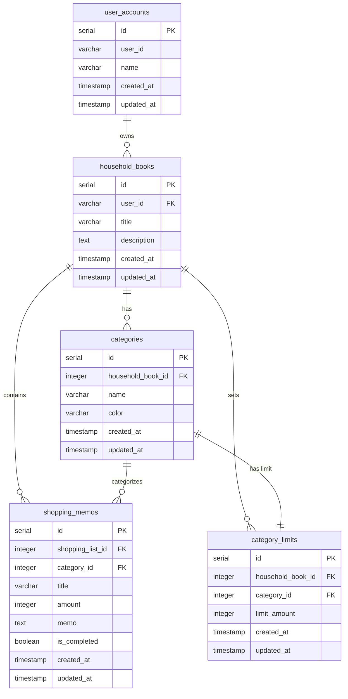

```mermaid
erDiagram
    user_accounts ||--o{ household_books : "owns"
    household_books ||--o{ categories : "has"
    household_books ||--o{ shopping_memos : "contains"
    categories ||--o{ shopping_memos : "categorizes"
    household_books ||--o{ category_limits : "sets"
    categories ||--|| category_limits : "has limit"

    user_accounts {
        serial id PK
        varchar user_id
        varchar name
        timestamp created_at
        timestamp updated_at
    }

    household_books {
        serial id PK
        varchar user_id FK
        varchar title
        text description
        timestamp created_at
        timestamp updated_at
    }

    categories {
        serial id PK
        integer household_book_id FK
        varchar name
        varchar color
        timestamp created_at
        timestamp updated_at
    }

    shopping_memos {
        serial id PK
        integer shopping_list_id FK
        integer category_id FK
        varchar title
        integer amount
        text memo
        boolean is_completed
        timestamp created_at
        timestamp updated_at
    }

    category_limits {
        serial id PK
        integer household_book_id FK
        integer category_id FK
        integer limit_amount
        timestamp created_at
        timestamp updated_at
    }
``` 