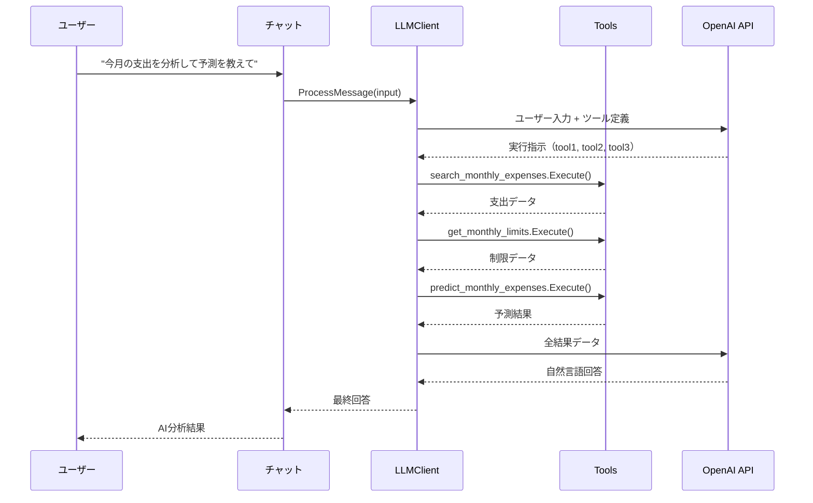
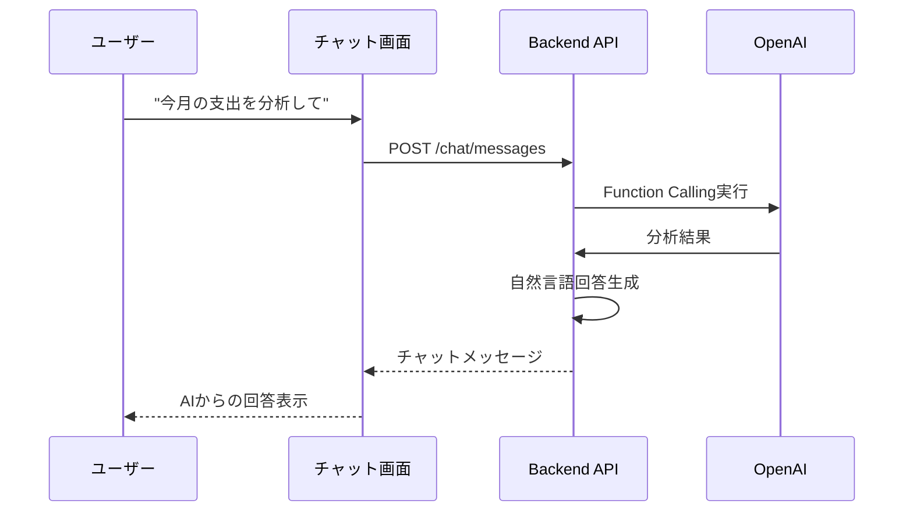

# AI Function Calling 実装設計書

## 1. 概要

Vue3 FSD Household Budget システムにおけるAI Function Callingの実装により、月間支出分析と予測機能を実現する。

### 目的
- 月間支出データの自動検索・分析
- 支出制限との比較分析
- 月末支出予測の自動生成
- 自然言語による支出分析クエリの処理

### 対象Issue
- [GitHub Issue #76](https://github.com/myantyuWorld/vue3-fsd-household-budget/issues/76)

## 2. 現在のシステム分析

### 2.1 データモデル
```go
// 支出データ
type ShoppingAmount struct {
    ID              ShoppingID
    HouseholdID     HouseHoldID
    CategoryID      CategoryID
    Amount          int
    Date            string
    Memo            string
    AnalyzeID       int
    Analyze         ReceiptAnalyze
    Category        Category
}

// カテゴリ別制限
type CategoryLimit struct {
    ID              CategoryLimitID
    HouseholdBookID HouseHoldID
    Category        Category
    LimitAmount     int
}

// 支出サマリー
type SummarizeShoppingAmounts struct {
    TotalAmount      int
    CategoryAmounts  []CategoryAmount
    ShoppingAmounts  []ShoppingAmount
}
```

### 2.2 既存API
- `GET /household/{householdID}/shopping/record?date={date}` - 月間支出データ取得
- `GET /household/{id}` - 家計簿データ（制限含む）取得
- `POST /chat/messages` - AI Assistant通信

## 3. Function Calling アーキテクチャ

### 3.1 システム構成
```
Frontend (Vue3) → Backend (Go) → AI Service (OpenAI) → Function Tools
                     ↓
                Database (PostgreSQL)
```

### 3.2 Function Calling フロー
1. **ユーザー入力**: 自然言語での支出分析クエリ
2. **AI判断**: 必要なFunctionの特定（詳細設計は3.3参照）
3. **Function実行**: 対応するFunction Toolの呼び出し
4. **データ取得**: データベースからの情報取得
5. **AI分析**: 取得データの分析・予測
6. **結果表示**: ユーザーへの回答生成

### 3.3 AI判断ロジック設計

#### 3.3.1 基本構成
GitHub Issue #76のコメントで示された設計パターンに基づく実装:

**Tool Interface**
```go
type Tool interface {
    Name() string
    Description() string
    Execute(params map[string]interface{}) (interface{}, error)
}
```

**LLMClient構造**
```go
type LLMClient struct {
    client *openai.Client
    tools  []Tool
}

func (c *LLMClient) ProcessMessage(input string) (string, error) {
    // 1. ユーザー入力とツール定義をLLMに送信
    // 2. 実行すべきツールの指示を受信
    // 3. 指定されたツールを実行
    // 4. 最終回答を生成
}
```

#### 3.3.2 支出分析ツール実装

**ExpenseSearchTool**
```go
type ExpenseSearchTool struct {
    repository ExpenseRepository
}

func (t *ExpenseSearchTool) Name() string {
    return "search_monthly_expenses"
}

func (t *ExpenseSearchTool) Description() string {
    return "指定された月の支出データを検索し、カテゴリ別に集計する"
}

func (t *ExpenseSearchTool) Execute(params map[string]interface{}) (interface{}, error) {
    // パラメータ解析
    // データベースアクセス
    // 結果の構造化
}
```

**LimitRetrievalTool**
```go
type LimitRetrievalTool struct {
    repository CategoryRepository
}

func (t *LimitRetrievalTool) Name() string {
    return "get_monthly_limits"
}

func (t *LimitRetrievalTool) Execute(params map[string]interface{}) (interface{}, error) {
    // 予算制限データの取得
}
```

**PredictionTool**
```go
type PredictionTool struct {
    repository ExpenseRepository
    predictor  *ExpensePredictor
}

func (t *PredictionTool) Name() string {
    return "predict_monthly_expenses"
}

func (t *PredictionTool) Execute(params map[string]interface{}) (interface{}, error) {
    // 予測計算の実行
}
```

#### 3.3.3 処理フロー


#### 3.3.4 ツール管理とDI

**ツールレジストリ**
```go
type ToolRegistry struct {
    tools map[string]Tool
}

func NewToolRegistry(expenseRepo ExpenseRepository, categoryRepo CategoryRepository) *ToolRegistry {
    registry := &ToolRegistry{tools: make(map[string]Tool)}
    
    // ツールの登録
    registry.Register(NewExpenseSearchTool(expenseRepo))
    registry.Register(NewLimitRetrievalTool(categoryRepo))
    registry.Register(NewPredictionTool(expenseRepo, NewExpensePredictor()))
    
    return registry
}
```

**ユースケース統合**
```go
type ChatUsecase struct {
    llmClient *LLMClient
}

func (u *ChatUsecase) ProcessChatMessage(input string, householdID int) (*ChatMessage, error) {
    // LLMClientでFunction Calling処理
    response, err := u.llmClient.ProcessMessage(input)
    if err != nil {
        return nil, err
    }
    
    // チャットメッセージとして保存・返却
    return u.saveChatMessage(response, householdID)
}
```

## 4. Function Tools 設計

### 4.1 Expense Data Search Tool
**目的**: 月間支出データの検索・取得

#### 4.1.1 Function定義
```json
{
  "name": "search_monthly_expenses",
  "description": "指定された月の支出データを検索し、カテゴリ別に集計する",
  "parameters": {
    "type": "object",
    "properties": {
      "household_id": {
        "type": "integer",
        "description": "家計簿ID"
      },
      "year": {
        "type": "integer",
        "description": "対象年"
      },
      "month": {
        "type": "integer",
        "description": "対象月"
      },
      "category_id": {
        "type": "integer",
        "description": "カテゴリID（オプション）"
      }
    },
    "required": ["household_id", "year", "month"]
  }
}
```

### 4.2 Monthly Limit Retrieval Tool
**目的**: 月間支出制限の取得

#### 4.2.1 Function定義
```json
{
  "name": "get_monthly_limits",
  "description": "指定された家計簿の月間支出制限を取得する",
  "parameters": {
    "type": "object",
    "properties": {
      "household_id": {
        "type": "integer",
        "description": "家計簿ID"
      },
      "category_id": {
        "type": "integer",
        "description": "カテゴリID（オプション）"
      }
    },
    "required": ["household_id"]
  }
}
```

### 4.3 Predictive Analysis Tool
**目的**: 月末支出予測の生成

#### 4.3.1 Function定義
```json
{
  "name": "predict_monthly_expenses",
  "description": "現在の支出ペースから月末の支出予測を生成する",
  "parameters": {
    "type": "object",
    "properties": {
      "household_id": {
        "type": "integer",
        "description": "家計簿ID"
      },
      "year": {
        "type": "integer",
        "description": "対象年"
      },
      "month": {
        "type": "integer",
        "description": "対象月"
      },
      "current_date": {
        "type": "string",
        "description": "現在日付（YYYY-MM-DD形式）"
      }
    },
    "required": ["household_id", "year", "month", "current_date"]
  }
}
```

#### 4.3.2 Backend実装
**処理内容**
- **Handler**: パラメータ抽出、レスポンス変換
- **Usecase**: 予測データ取得制御、ドメインサービス呼び出し
- **Domain**: 予測アルゴリズム実行、アラート生成
- **Repository**: 支出データ・制限データ取得
```

#### 4.3.3 ドメインモデル設計

**ExpensePredictor構造体**
```go
type ExpensePredictor struct{}

type CategoryPrediction struct {
    CategoryID       CategoryID
    CategoryName     string
    CurrentAmount    int
    PredictedAmount  int
    LimitAmount      int
    IsOverBudget     bool
    RemainingAmount  int
    DailyAverage     float64
}
```

**予測アルゴリズム**
- 日割り計算による線形予測
- カテゴリ別予算オーバー判定
- 残り予算計算
- アラート生成ロジック

**責務**
- 支出パターンの分析
- 予測計算の実行
- 予算制限との比較
- アラート条件の判定


## 5. フロントエンド実装

### 5.1 Chat Feature設計

#### 5.1.1 基本方針
- フロントエンドは既存のチャット機能を活用
- ユーザーはチャット画面で自然言語で質問
- バックエンドがFunction Callingで適切な処理を実行
- 結果はチャットメッセージとして表示

#### 5.1.2 処理フロー



## 6. データベース拡張

### 6.1 Function Call履歴テーブル
```sql
CREATE TABLE function_call_logs (
    id SERIAL PRIMARY KEY,
    household_id INTEGER REFERENCES household_books(id),
    user_id INTEGER REFERENCES user_accounts(id),
    function_name VARCHAR(100) NOT NULL,
    parameters JSON NOT NULL,
    result JSON,
    execution_time INTEGER, -- milliseconds
    created_at TIMESTAMP DEFAULT CURRENT_TIMESTAMP
);
```

### 6.2 支出予測データテーブル
```sql
CREATE TABLE expense_predictions (
    id SERIAL PRIMARY KEY,
    household_id INTEGER REFERENCES household_books(id),
    year INTEGER NOT NULL,
    month INTEGER NOT NULL,
    category_id INTEGER REFERENCES categories(id),
    current_amount INTEGER NOT NULL,
    predicted_amount INTEGER NOT NULL,
    prediction_date DATE NOT NULL,
    created_at TIMESTAMP DEFAULT CURRENT_TIMESTAMP
);
```

## 7. セキュリティ考慮事項

### 7.1 認証・認可
- Function Call実行時の家計簿アクセス権限チェック
- ユーザー認証トークンの検証
- 家計簿データの所有者確認

### 7.2 データ保護
- 個人財務情報の暗号化
- Function Call結果のログ管理
- 不要なデータの自動削除

### 7.3 API制限
- Function Call実行回数の制限
- レート制限の実装
- 異常な実行パターンの検出

## 8. パフォーマンス最適化

### 8.1 キャッシュ戦略
- 月間支出データのキャッシュ
- 予測結果の一時保存
- 頻繁にアクセスされるデータの最適化

### 8.2 データベース最適化
- 支出データ検索用インデックス
- 日付範囲クエリの最適化
- 集計クエリのパフォーマンス向上

## 9. 運用・監視

### 9.1 ログ監視
- Function Call実行状況の監視
- エラー発生率の追跡
- 実行時間の監視

### 9.2 メトリクス
- Function使用頻度
- 予測精度の測定
- ユーザー満足度の追跡

## 10. 実装フェーズ

### Phase 1: 基盤実装
1. Function Tools基盤の構築
2. Backend API実装
3. 基本的なFunction Call機能

### Phase 2: 機能拡張
1. 予測アルゴリズムの実装
2. フロントエンド結果表示
3. チャート・グラフ表示

### Phase 3: 最適化
1. パフォーマンス最適化
2. セキュリティ強化
3. 監視機能の追加

## 12. 生成AI活用の詳細と価値提案

### 12.1 生成AI使用部分の詳細
この機能は**OpenAI GPT**を活用した生成AI機能です。

#### 12.1.1 自然言語処理
```
ユーザー: "今月の支出を分析して、このペースだと月末にいくらになる？"
↓
AI: ユーザーの意図を理解し、適切なFunction Toolを選択・実行
```

#### 12.1.2 AI Function Calling
- **OpenAI GPT**が3つのFunction Toolを適切に選択・実行
- `search_monthly_expenses` → `get_monthly_limits` → `predict_monthly_expenses`
- AIが状況に応じて最適な組み合わせを判断

#### 12.1.3 結果の解釈と回答生成
```
AI回答例:
"1月15日現在の食費は20,000円です。このペースだと月末には42,000円となり、
予算40,000円を2,000円オーバーする可能性があります。
日用品は5,000円で予算内に収まる見込みです。"
```

### 12.2 既存のAI機能との統合
現在のシステムにも既にAI機能があります：
- **レシート分析**: OpenAIで領収書を自動分析
- **チャット機能**: AI Assistantとの会話

今回の設計は、この既存のAI基盤を拡張してFunction Callingを追加する形になります。

### 12.3 従来のシステムとの違い

#### 従来のシステム（静的な分析）
```
- 決まった画面で決まった集計結果を表示
- ユーザーが自分で数値を解釈する必要
- 固定的なレポート形式
```

#### 生成AI活用システム（動的な分析）
```
- 自然言語で柔軟な質問が可能
- AIが状況に応じた洞察を提供
- パーソナライズされた提案・アドバイス
```

### 12.4 具体的な使用例

#### 12.4.1 日常的な支出相談
```
ユーザー: "外食費が多すぎる気がするけど、どうかな？"
AI: "過去3ヶ月の外食費を分析したところ、平均15,000円/月で、
     同世代の平均12,000円より25%高めです。
     週1回減らすと年間36,000円の節約になります。"
```

#### 12.4.2 目標設定と計画立案
```
ユーザー: "来月の旅行のために、今月どれくらい節約すればいい？"
AI: "来月の旅行予算50,000円を確保するには、
     食費を30,000円以下（現在35,000円）に抑える必要があります。
     自炊を週2回増やすことをお勧めします。"
```

#### 12.4.3 緊急時の対応提案
```
ユーザー: "今月あと1週間で食費の予算がもうない..."
AI: "残り1週間で食費7,000円以内に抑える必要があります。
     業務スーパーでの買い物や、冷凍庫の食材活用で
     1日1,000円以内の食事プランを提案します。"
```

### 12.5 生成AIの学習・適応機能

#### 12.5.1 個人の支出パターン学習
- 過去の支出データから個人の傾向を把握
- 曜日別、時間帯別の支出パターン分析
- 季節性や特殊イベントの影響を考慮

#### 12.5.2 予測精度の向上
- 実際の支出結果と予測の差異から学習
- ユーザーの行動変化に応じた予測モデル調整
- 外部要因（物価上昇、収入変動）の反映

#### 12.5.3 パーソナライズされた提案
- ユーザーの価値観や優先順位の理解
- 実現可能な節約提案の生成
- モチベーション維持のためのメッセージ

### 12.6 生成AIならではの価値

#### 12.6.1 文脈理解能力
```
ユーザー: "今月厳しいから、何か良いアイデアない？"
AI: "先月の支出を分析すると、コンビニでの少額購入が累計8,000円ありました。
     まとめ買いに変更するだけで月3,000円は節約できそうです。
     また、サブスクリプションの見直しも効果的です。"
```

#### 12.6.2 創造的提案力
- データから新しい節約アイデアを発見
- 他のユーザーの成功事例を参考にした提案
- 生活スタイルに合わせたカスタマイズ提案

#### 12.6.3 感情的サポート
```
ユーザー: "また予算オーバーしちゃった..."
AI: "大丈夫です！今月は予算を10%オーバーしましたが、
     前月比では実は5%改善しています。
     小さな変化でも継続することが大切です。"
```

#### 12.6.4 継続的対話
- 前回の相談内容を踏まえた継続的なアドバイス
- 目標達成の進捗確認とモチベーション維持
- 長期的な家計改善の伴走支援

### 12.7 技術的な生成AI活用ポイント

#### 12.7.1 プロンプトエンジニアリング
```
システムプロンプト例:
"あなたは家計管理の専門家です。
ユーザーの支出データを分析し、実用的で実現可能な
アドバイスを提供してください。
数値だけでなく、感情的なサポートも重要です。"
```

#### 12.7.2 RAG（Retrieval-Augmented Generation）
- 個人の過去の支出データを活用した回答生成
- 同様の状況のユーザーの成功事例を参照
- 家計管理のベストプラクティス知識の活用

#### 12.7.3 Few-shot Learning
- 家計管理の専門用語と文脈の理解
- 適切な提案の仕方の学習
- 日本の家計事情に特化した知識の活用

#### 12.7.4 温度調整とパラメータ最適化
- **正確性重視**: 数値計算や予測では低温度設定
- **創造性重視**: 節約アイデア提案では高温度設定
- **一貫性確保**: 同じユーザーへの回答スタイル統一

### 12.8 AIの価値創出シナリオ

#### 12.8.1 初心者向け家計管理教育
```
ユーザー: "家計管理って何から始めればいいの？"
AI: "まずは1ヶ月間の支出を記録することから始めましょう。
     あなたの支出パターンを分析すると、
     食費と日用品で全体の70%を占めています。
     この2つのカテゴリから管理を始めるのが効果的です。"
```

#### 12.8.2 上級者向け最適化支援
```
ユーザー: "もっと効率的な家計管理方法はない？"
AI: "データ分析の結果、平日の昼食代が月15,000円と
     全体の12%を占めています。
     週2回の弁当で月5,000円節約し、
     その分を投資に回すことで年間6万円の効果が期待できます。"
```

### 12.9 実装における生成AI活用の注意点

#### 12.9.1 データプライバシー
- 個人の財務データの適切な処理
- AI学習データとしての利用制限
- 外部サービスとの連携時の情報保護

#### 12.9.2 回答の品質保証
- 金融アドバイスの責任範囲の明確化
- 不適切な提案の検出と修正機能
- 専門家によるAI回答の定期的なレビュー

#### 12.9.3 依存性の管理
- AI機能の障害時の代替手段
- 基本的な家計管理機能の独立性確保
- ユーザーの自立的な判断力の育成

この生成AI活用により、従来の静的な家計管理システムを**インタラクティブなAI家計コンサルタント**に進化させ、ユーザーの長期的な家計改善を支援します。

---

この設計書に基づいて、段階的にAI Function Calling機能を実装し、ユーザーの支出分析体験を向上させることができます。